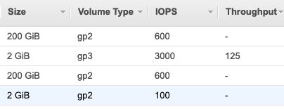

Hello,

As promised in my last monthly email, I'm now sharing monthly the progress achieved in the previous month and what's coming soon.

I've also resumed the monthly AskMeAnything-style community calls, and below you can see the recording of our previous one.


## Progress report May 2021

- I helped polish further the contribution by Alberto (mello7tre on Github), which simplified the event handling logic by introducing a FIFO SQS queue for serializing AutoScaling operations (such as temporarily extending the maximum capacity and suspending AutoScaling processes) instead of previously calling an auxiliary Lambda function with concurrency 1. The code and internal architecture is significantly cleaner and much more robust after our initial tests and I'm very happy with the way it works. I'd really appreciate if you could give it a try in a test environment and please let me know if you run into any issues.
- this month I also merged the EBS storage upgrade logic that converts GP2 volumes to 20% cheaper and more performant GP3 volumes for EBS volumes smaller than 170GB. There's also a change for similarly converting IO2 volumes to IO3, but that's unlikely to make much of a difference for Spot use cases. This is also available in the current nightly build, and here's how it looks like for GP2 volumes:

These have also been discussed in detail in the latest Zoom call, you can see more in the above recording.

## Future work

- My focus for the next few weeks will be working towards the next stable release for my Patreon supporters, consisting mainly on testing and bug-fixing work but also making the SQS and EBS features mentioned above more configurable.

- As I mentioned last month, at work I'll focus on implementing certain features in the interest of my employer, such as multiple Spot allocation strategies and also to enhance the Spot termination handling logic to immediately launch Spot instances ideally without having to run any On-demand provisioned by the ASG using the Launch Configuration.

These should keep me busy over the next few months, but as I said, I'll share my progress monthly as I work on these so stay tuned for more updates, I'm incredibly excited about the future of AutoSpotting.

As always, I'm always eager to hearing from you, so feel free to reach out if you need any help, have any suggestions or if you have any sort of feedback. I'd also love to see you in our next Community Zoom call in a couple of weeks, I'll share the invite soon.

Best regards,

Cristian
