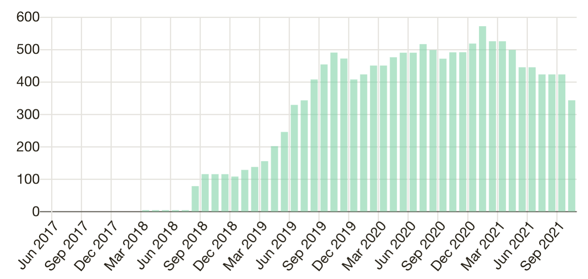

Hello,

As usual, here's my latest monthly report.

## AutoSpotting

Since the previous month there hasn't been much going on in the mainline repo, at least not from my side. The only thing I did there was updating dependencies, including instance type information for the recently released [M6i](https://aws.amazon.com/ec2/instance-types/m6i/) instance types.

From the community side, I'm very thankful to mello7tre who contributed a couple of significant changes:

- allow us to [reuse](https://github.com/cloudutil/AutoSpotting/commit/ca139105a9aa995aeb2c339686713c382e5c02e6) existing Spot instances instead of always launching new ones, saving some time when doing Spot replacements in certain situations.
- added a global [configuration](https://github.com/cloudutil/AutoSpotting/commit/5c9ca6b940e0205725750ffdb612eb0f1517da78) flag (defaults to off) that allows us to disable the Instance Rebalancing Recommendation events, which sometimes get emitted without resulting in a Spot termination, creating additional instance churn. The caveat is that with this enabled you only get the 2-minute termination notification, and don't get to run the instance termination lifecycle hooks, but it gives you a bit less instance churn if you don't need those.

This month I also updated the Terraform code to match CloudFormation and documented it as officially supported installation method on the [AWS Marketplace](https://aws.amazon.com/marketplace/pp/prodview-6uj4pruhgmun6).

Speaking of the Marketplace, I also offered a private build for Patreon subscribers and people who contributed code and bug reports over the last year, which charges only 3% of the savings. Feel free to reach out to me if you qualify for this.

But even though not so much landed in the repo, I've been working a lot on a very exciting new [feature](https://github.com/cloudutil/AutoSpotting/pull/471) that switches the underlying API used to launch Spot instances. (This piece of work has been sponsored by my current employer, and I'm very thankful for giving me this opportunity.)

Previously, Spot instances were launched using the RunInstances API call, which iterated over a list of instance types in increasing order of the hourly price, and would attempt to launch instances from each type from the list until successful. This worked well in most cases, but could sometimes give instances in shallow Spot pools that would soon be terminated, resulting in high interruption rates.

The new implementation uses the newer CreateFleet API call, which takes the same list of instance types we used to iterate over, but now feeds it to the [capacity-optimized-prioritized](https://docs.aws.amazon.com/AWSEC2/latest/UserGuide/ec2-fleet-examples.html#ec2-fleet-config11) allocation strategy. This will essentially skip instance types in shallow capacity pools that are likely to be terminated soon and would only settle for the lowest price pool with good capacity, with the caveat that the price may not be the absolute lowest possible.

In practice the interruption rates can sometimes be up to 10x better than with the lowest-cost strategy we used, with a marginal cost increase, so this is probably worth it for most users.

In case you want the old behavior, it will also be made available as a configuration option by using the lowest-cost allocation strategy.

This feature turned out quite a massive undertaking because I used the opportunity to also refactor some of the code base to reduce tech debt, as when I started to work on it it was really hard to navigate that part of the codebase. We're now at around 5500 lines of code added and 4000 lines removed, most of it is moving stuff around, essentially splitting a large file into multiple smaller and more manageable files, but also adding quite a few unit tests, since much of the previous code had poor unit test coverage.

So far it seems to work pretty well after fixing some bugs, but there are probably more and it needs a bit more testing and polishing before I can confidently merge it, but I expect it to land within the next couple of weeks.

## EBS Optimizer

I'm happy to announce that WBS Optimizer is now Open Source, you can check it out at https://github.com/cloudutil/EBS-Optimizer

No significant changes landed to the repo over the last month except for adding a Readme when I open sourced it.

One thing I've started working on is changing the billing model to charge 50% of a month's savings when converting each volume, instead of the current hourly billing.

This is a better fit for such a tool which can be used in a one-off scenario but it is a bit challenging to make it work in a way that avoids penalizing volume churn.

I'm currently exploring a few ways to avoid this, but it's still work in progress and hasn't been fully figured out.

This change will also reduce the annualized cost from up to 5% to up to around 4.17%.

## Websites and git repos

- After I open sourced EBS Optimizer, I also moved all the AutoSpotting repos under the new [cloudutil](https://github.com/cloudutil) Github organization
- I performed a few changes on [autospotting.io](https://autospotting.io), mainly simplifying the list of features which was probably too detailed.
- [cloudutil.io](https://cloudutil.io) hasn't been changed over the last month

I'm now also in the process of getting someone to help me with my websites, hope to see more changes next time. I plan to add more content about AutoSpotting and EBS Optimizer, and probably also use it as an entry-point to this newsletter.

## Income report

Previously I wasn't actively sharing about the income I get from AutoSpotting, except for the public stats visible on Patreon, but I think you deserve to know more about this so going forward I'll try to provide more details on this front, especially since the AWS Marketplace shows no public income data.

To show you my current baseline, below you can see a graph of my previous Patreon earnings:

I started using Patreon back in June 2017 in a donations mode only and got my first backer in February 2018. For a few months got $5 from a single patron, and things just started taking off once I offered the stable release monthly subscription. The numbers were growing nicely for a while, but started slowing down and even dropping earlier this year.

The feedback from former subscribers indicated that they wanted a new stable release, some no longer used it, while a few churned after switching jobs or changed credit cards. Out of this feedback I decided to double down and cut a new stable release. I also decided to move the stable releases to the [AWS Marketplace](https://aws.amazon.com/marketplace/pp/prodview-6uj4pruhgmun6), in order to reduce the billing friction and to decouple it from individual employees.

I also got feedback that the $29 flat fee was a bit high for people who wanted to get started small, so that's why I changed it to a more pay-as-you-go model that charges a small percentage of the savings. This should be friendlier to new or smaller users but also potentially charging more the larger ones, which I find more fair.

Offer the last few months the Patreon income had stabilized around $423 from 12 subscribers. The last month dropped further to $343 and 10 subscribers, because a couple of people switched to the AWS Marketplace.

Speaking of the Marketplace, the number of subscribers has been growing nicely, and yesterday was my record day at $4.75 from 4 paying users. Extrapolated, this comes around $142 MRR,  covering the last month's Patreon churn and adding a bit on top. In addition to the paying users, I also see a few who just installed it and haven't enabled it yet. I've also starting getting inquiries from a couple of large companies, hope to see something eventually come out of these.

The total MRR at the end of September comes around $485, approaching the former maximum from Patreon, and considering the growth rate I expect to overtake it sometime in October.

I haven't yet got the monthly report from the Marketplace, but it's probably around $70-80 since most people started towards the end of the month. AWS will take a cut out of this and will give some of it as credits that would cover my personal AWS account fees, but all in all I think it was a good first month on the AWS Marketplace, and from what I can see I expect October to be even better.

## Plans for October and beyond

- Merge the replacement of RunInstances with instant EC2 Fleets for launching Spot instances with the different allocation strategies, such as capacity-optimized and include it in a new Marketplace release
- Add more docs on [cloudutil.io](https://cloudutil.io) about both EBS Optimizer and AutoSpotting
- Proactive Spot-toSpot instance replacements in the event of instance rebalancing notifications, with ICE-proof on-demand failover across multiple instance types

- Finish the EBS Optimized billing changes

I'm incredibly excited about the future of my tools and I'll keep sharing my progress monthly as I work on them, so stay tuned for future updates.

I'm always eager to hearing from you, so feel free to reach out if you have any questions, feedback, or need any help. Just answer this email and I'll personally answer every single email I get from you.

Best regards,

Cristian
